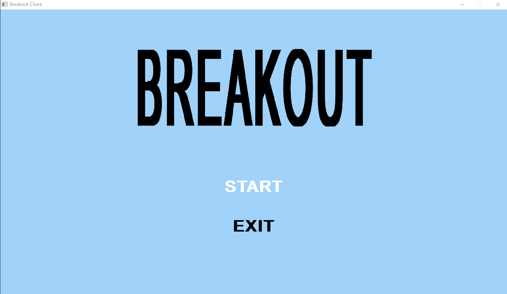
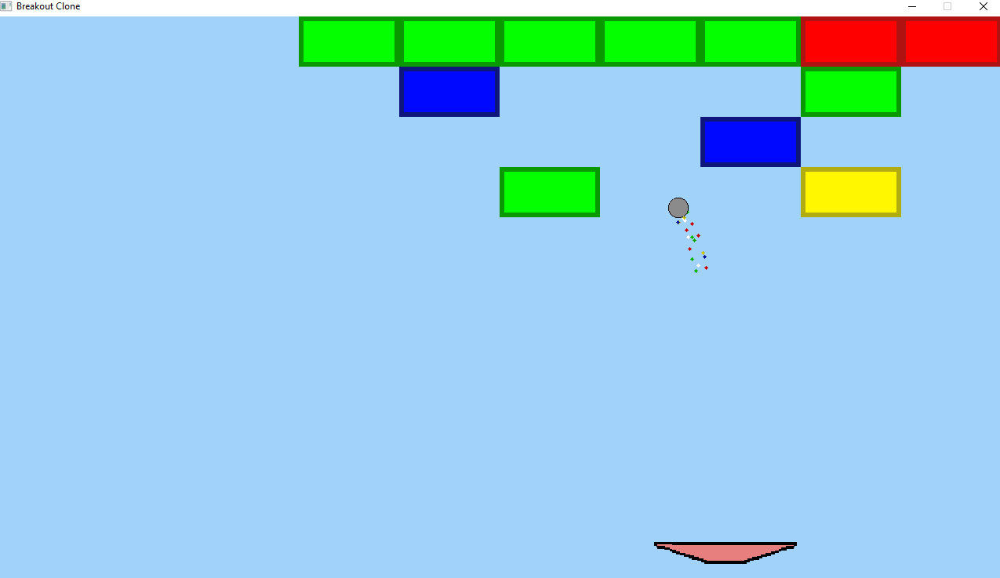
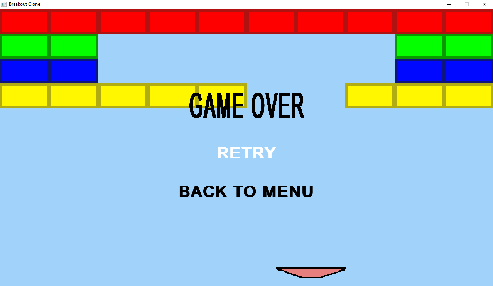

# Breakout Game Clone, created using SDL2

I wanted to get a better understanding of C++ by using it in practice. I figured that a good way to achieve that is by creating a simple game, but instead of using a "high" level game engine like Unreal, I'd use a much lower level library such as SDL2.

Hence, this project was born. It's a basic game, but I believe it was an amazing introduction to the fundamentals of game development and I'm pretty satisfied with the result.
Some of the code can be refactored to be more easily reusable, but my focus was more on creating the actual game and not so much on creating an engine for creating 2D games.

## Dependencies

### [SDL 2.0.14](https://www.libsdl.org/ "libSDL's Download Page")

### [SDL_image 2.0](https://www.libsdl.org/projects/SDL_image/ "SDL's Image Library")

### [SDL_ttf 2.0](https://www.libsdl.org/projects/SDL_ttf/ "SDL's TrueFont Library")

## Installation

### Windows
If you want to play the game, simply clone the repository, copy the `assets` folder inside the `build` folder and run `Breakout.exe`.

### Source code/other platforms

The process of building the source files yourself varies for different operating systems and I cannot give a detailed explanation for each. Some general directions are to `clone the repository`, install the `libraries` listed in the [Dependencies](#Dependencies) section and then `include and link` them to your workspace.

## Systems

- Game entity base class for creating entities that are to be rendered to the screen
  
- Texture manager, which can render different textures/frames from the same file (sprite sheet)

- Simple particles, which leave a trail after the ball

- Collision system for handling the collisions of the ball with the bricks and the platform

- Menu system integrated through states SDL's TrueType font library and game states

## Showcase

